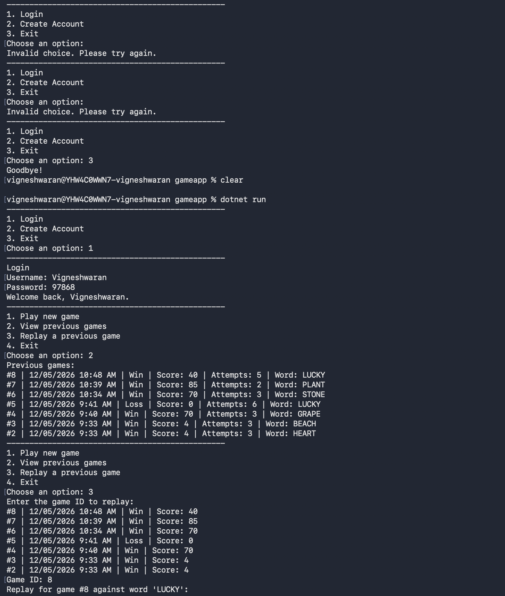
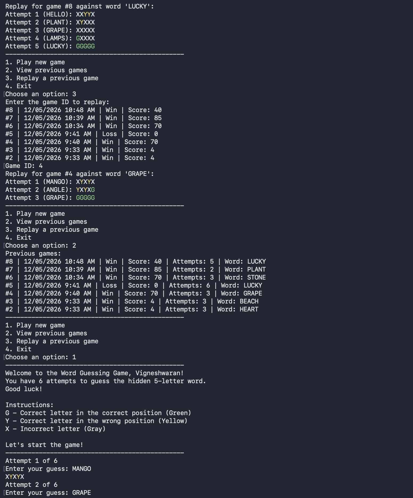
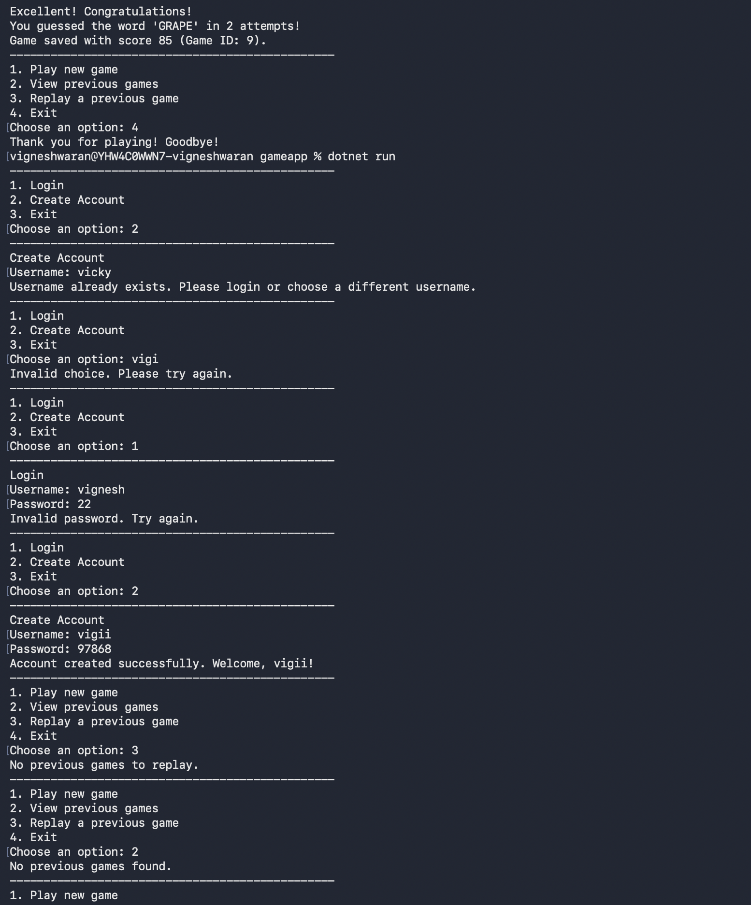

# GameApp

- GameApp is a console-based word guessing game built with .NET and PostgreSQL.
- The player can create an account, log in, play new games, view previous games, and replay past rounds.
- The game stores users, words, scores, and replay data in the database using ADO.NET and Npgsql.

## Folder Structure

- `Program.cs` - application entry point.
- `Context` - database connection helper.
- `Data` - word provider logic.
- `Database` - SQL schema and seed script.
- `Exceptions` - custom input validation exceptions.
- `Inputs` - user input validation service.
- `Interfaces` - service and repository contracts.
- `Models` - game, player, and history models.
- `Repositories` - database access classes.
- `Services` - game flow, authentication, feedback, and password handling.

## Main Features

- Login and account creation.
- Word selection from PostgreSQL.
- Guess validation and feedback display.
- Score saving and previous game history.
- Replay of stored games.

## Game Flow

- Open the application.
- Choose `Login` or `Create Account`.
- After authentication, open the main menu.
- Select `Play new game` to start a round.
- Enter a 5-letter guess for each attempt.
- View feedback for each guess:
- `G` = correct letter and correct position.
- `Y` = correct letter and wrong position.
- `X` = letter not in the word.
- Win by guessing the hidden word within 6 attempts.
- On game end, save score, result, and moves to PostgreSQL.
- Use `View previous games` to see game history.
- Use `Replay a previous game` to replay stored attempts.

## Screenshots

