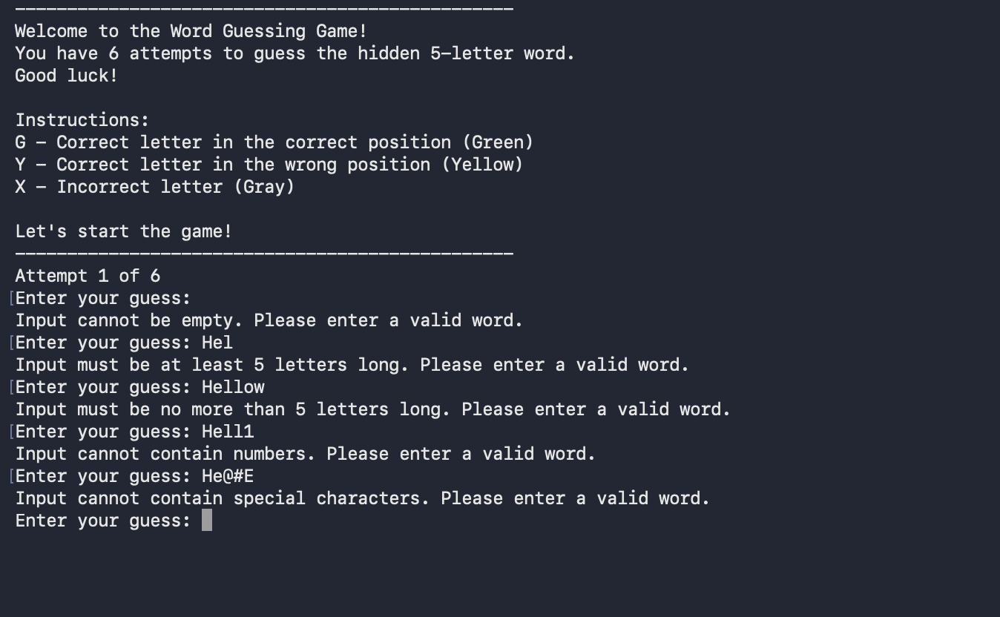
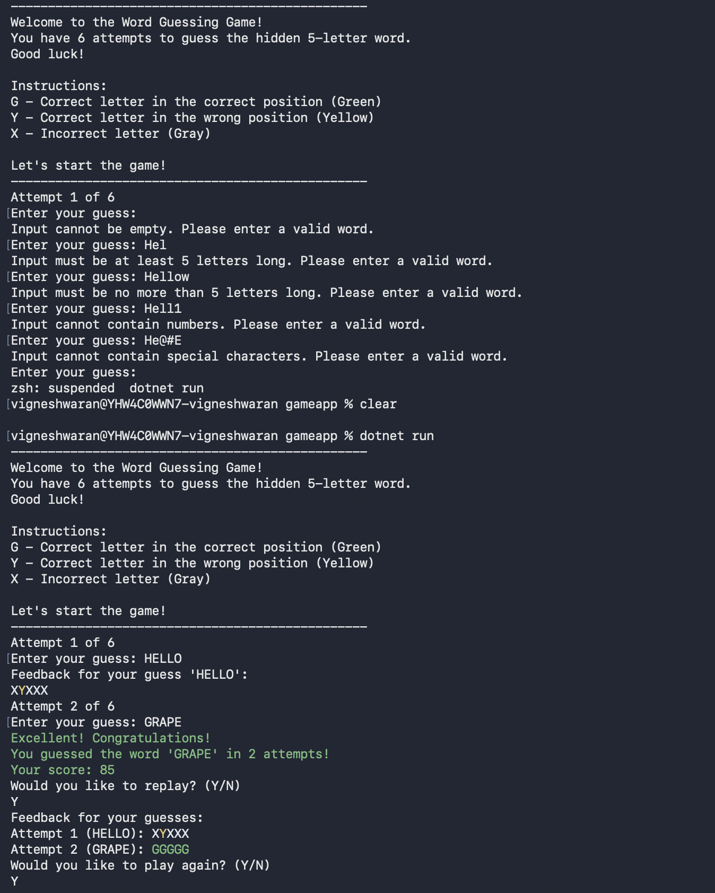
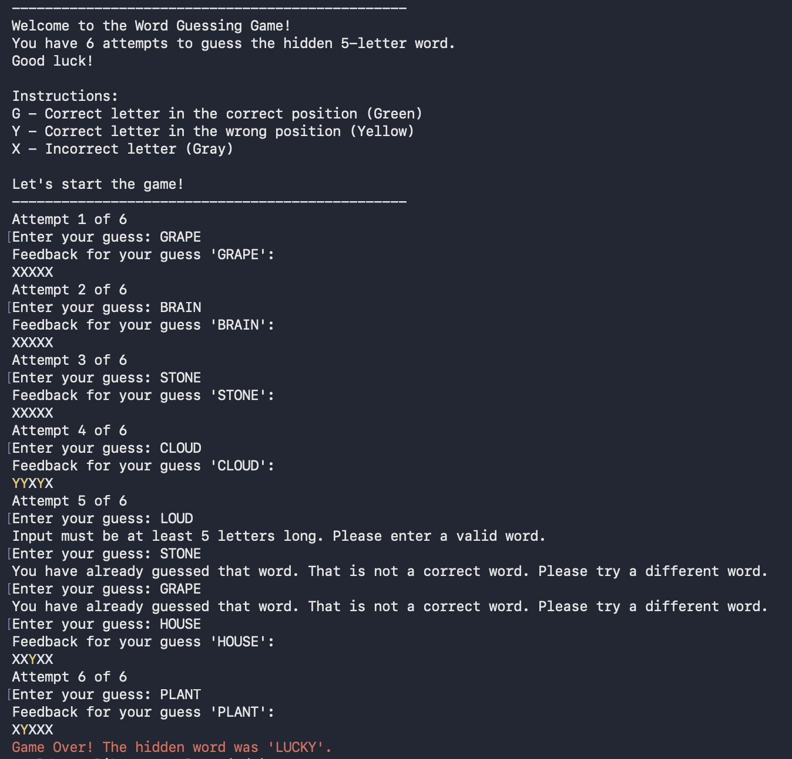

# Vigneshwaran B - GameApp

## Project Overview

- GameApp is a console-based word guessing game.
- The player must guess a hidden 5-letter word.
- The game gives feedback after every guess using color-based hints.
- The project is built with C# and .NET.

## Main Features

- Random hidden word selection from a  list of 5-letter words.
- Input validation for empty input, short words, long words, numbers, and special characters.
- Duplicate guess checking so the same word cannot be entered again.
- Feedback display for every attempt.
- Score calculation based on how early the player guesses the word.
- Replay option after a win or a loss.

## Game Rules

- You get 6 attempts to find the correct word.
- The hidden word is always 5 letters long.
- Each guess must also be exactly 5 letters.
- Only alphabetic characters are allowed.
- Repeated guesses are rejected.

## Feedback Meaning

- `G` means the letter is correct and in the correct position.
- `Y` means the letter is correct but in the wrong position.
- `X` means the letter is not in the hidden word.

## Game Flow

- The game starts by selecting a random word.
- The player enters a guess.
- The guess is validated before it is accepted.
- The game compares the guess with the hidden word.
- Feedback is shown for the guess.
- The game continues until the word is guessed or attempts run out.
- After the round ends, the player can replay or start a new game.

## Scoring System

- The score starts from 100.
- 15 points are reduced for each used attempt.
- The final score cannot go below 0.
- Guessing earlier gives a higher score.

## Project Structure

- `Program.cs` starts the application.
- `Services/GameService.cs` controls the game flow.
- `Inputs/GuessValidatorService.cs` validates user input.
- `Services/FeedbackGeneratorService.cs` creates the feedback string.
- `Data/WordProvider.cs` stores and returns random words.
- `Models/Game.cs` stores game state, attempts, guesses, and score.
- `Repositories/FeedbackRepository.cs` stores feedback history.
- `Exceptions/GuessWord/` contains custom exceptions for invalid input.

## Screenshots

- Exception handling example:



- Gameplay example 1:



- Gameplay example 2:



## How To Run

- Make sure .NET is installed on your machine.
- Open the project folder in a terminal.
- Run the game with:

```bash
dotnet run
```
